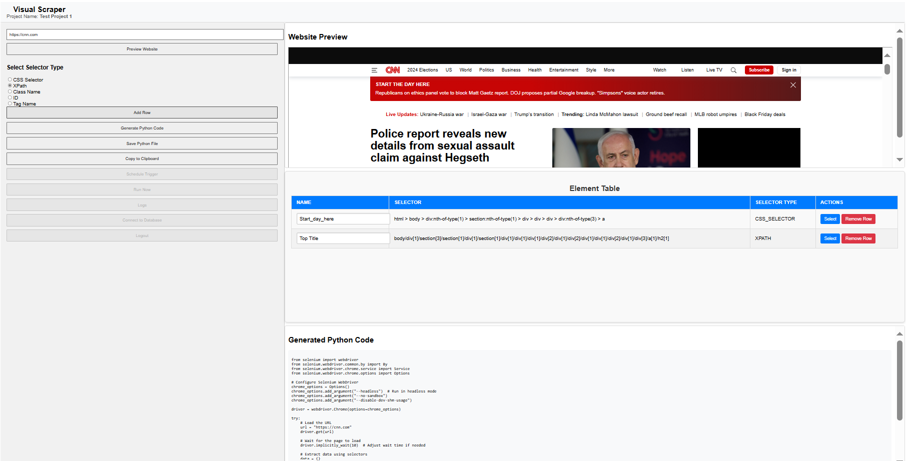

# Visual Web Scraper




## Overview
The **Visual Web Scraper** is a Python and React-based application designed to simplify web scraping with an interactive interface. Users can visually select elements from a webpage, generate corresponding selectors (XPath, CSS, or Attribute), and automatically generate Python code to scrape those elements.

This tool leverages **Selenium** for rendering dynamic web pages and supports dynamic interaction through an embedded preview pane.

---

## Features
- Visual webpage preview using Selenium.
- Selector generation for CSS, XPath, or attributes.
- Automated Python code generation for selected elements.
- Adjustable interface layout with an intuitive design.
- Handles dynamic, JavaScript-heavy web pages.
- Interactive element selection and highlighting.

---

## Tech Stack
- **Backend**: Python, Flask, Selenium
- **Frontend**: React.js
- **Dependencies**:
  - Flask
  - Selenium
  - fake-useragent
  - React.js
  - WebDriver (e.g., ChromeDriver)

---

## Prerequisites
Before setting up the project, ensure you have the following installed:
1. **Python 3.8+**
2. **Node.js** (for the React frontend)
3. **Google Chrome** (latest version)
4. **ChromeDriver** matching your Chrome version ([Download here](https://sites.google.com/chromium.org/driver/))

---

## Installation

### Backend Setup
1. Clone the repository:
   ```bash
   git clone https://github.com/bobykhani/visual_scraper.git
   cd visual_scraper
   ```

2. Set up a virtual environment (optional but recommended):
   ```bash
   python -m venv venv
   source venv/bin/activate  # On Windows: venv\Scripts\activate
   ```

3. Install dependencies:
   ```bash
   pip install -r requirements.txt
   ```

4. Ensure ChromeDriver is installed and added to your PATH. Test the installation:
   ```bash
   chromedriver --version
   ```

5. Start the Flask backend:
   ```bash
   python app.py
   ```

### Frontend Setup
1. Navigate to the `frontend` directory:
   ```bash
   cd frontend
   ```

2. Install dependencies:
   ```bash
   npm install
   ```

3. Start the React development server:
   ```bash
   npm start
   ```

---

## Usage
1. Open the frontend in your browser (usually at `http://localhost:3000`).
2. Enter the URL of the webpage you want to scrape.
3. Click **"Preview Website"** to load the webpage in the preview pane.
4. Select a **Selector Type** (XPath, CSS Selector, or Attribute).
5. Use the interactive preview to highlight and select elements.
6. Add the element(s) to the **Element Table**.
7. Click **"Generate Python Code"** to generate scraping code for the selected elements.
8. Copy the generated code and use it in your Python projects.

---

## Demo
*Screenshot of the tool interface (optional)*

---

## Folder Structure
```
visual_scraper/
├── app.py               # Flask backend for Selenium
├── requirements.txt     # Python dependencies
├── frontend/            # React frontend code
│   ├── src/             # Source files
│   ├── public/          # Public assets
│   └── package.json     # Frontend dependencies
└── README.md            # Project documentation
```

---

## Roadmap
- [ ] Add support for proxies.
- [ ] Integrate with a database for storing scraping configurations.
- [ ] Implement browser options for non-Chrome users.
- [ ] Add support for API-based scraping workflows.

---

## Contributing
Contributions are welcome! If you'd like to improve this project:
1. Fork the repository.
2. Create a new branch:
   ```bash
   git checkout -b feature-name
   ```
3. Commit your changes:
   ```bash
   git commit -m "Add feature-name"
   ```
4. Push to your branch:
   ```bash
   git push origin feature-name
   ```
5. Open a pull request.

---


## Contact
If you have any questions or feedback, feel fre to reach out:

- **Email**: bobykhani.data@gmail.com
- **GitHub**: [bobykhani](https://github.com/bobykhani)
